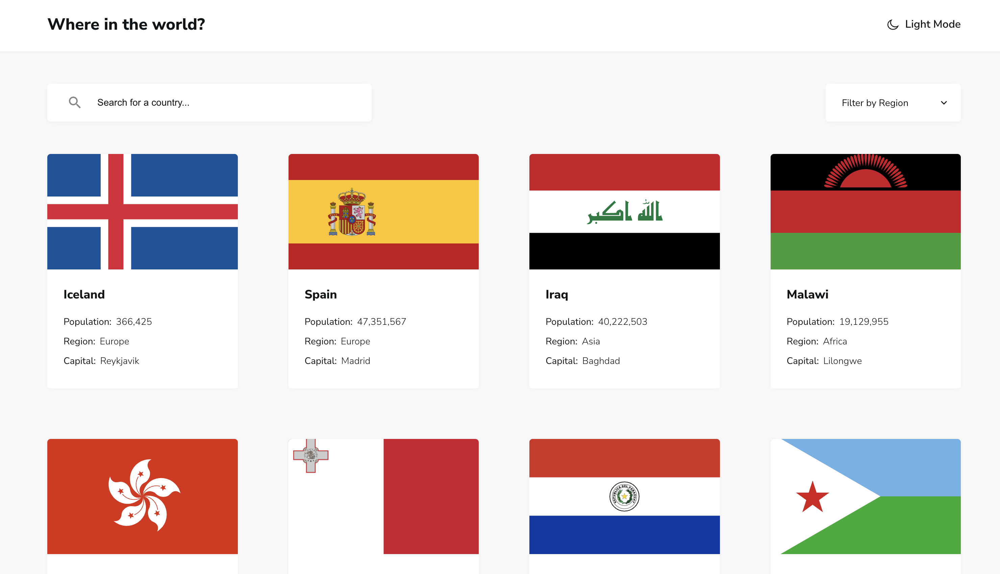
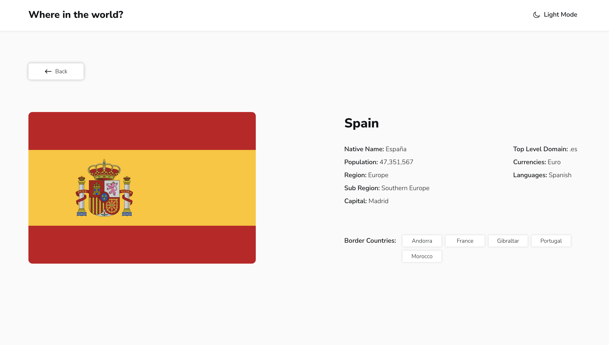

# Frontend Mentor - REST Countries API with color theme switcher solution

This is a solution to the [REST Countries API with color theme switcher challenge on Frontend Mentor](https://www.frontendmentor.io/challenges/rest-countries-api-with-color-theme-switcher-5cacc469fec04111f7b848ca). Frontend Mentor challenges help you improve your coding skills by building realistic projects. 

## Table of contents

- [Overview](#overview)
  - [The challenge](#the-challenge)
  - [Screenshot](#screenshot)
  - [Links](#links)
- [My process](#my-process)
  - [Built with](#built-with)
  - [Useful resources](#useful-resources)
- [Author](#author)

## Overview

### The challenge

Users should be able to:

- See all countries from the API on the homepage
- Search for a country using an `input` field
- Filter countries by region
- Click on a country to see more detailed information on a separate page
- Click through to the border countries on the detail page
- Toggle the color scheme between light and dark mode

### Screenshot

### Links

- Live Site URL: [Rest Countries API](https://rest-countries-api-pi-ten.vercel.app)

## My process

### Built with

- Desktop-first workflow
- [React](https://reactjs.org/) - JS library
- [Styled Components](https://styled-components.com/) - For styles
- [React Router](https://reactrouter.com/en/main) - For routing
- [React Query](https://tanstack.com/query/v4) - For caching

### Useful resources

- [React Router Tutorial](https://reactrouter.com/en/main/start/tutorial)
- [React Router Example](https://reactrouter.com/en/main/start/examples)
- [React Query Course](https://ui.dev/react-query)
- [React Query meets React Router](https://tkdodo.eu/blog/react-query-meets-react-router)

## Author

- Frontend Mentor - [@jimmy2130](https://www.frontendmentor.io/profile/jimmy2130)